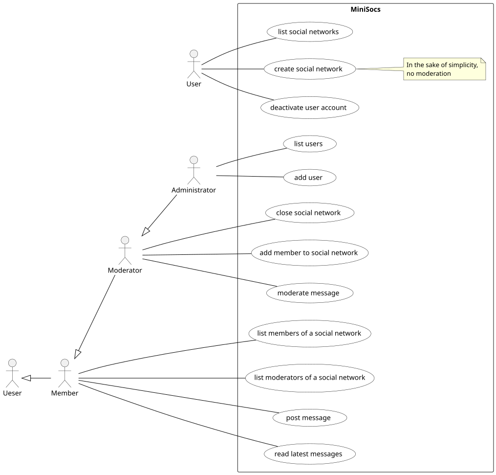
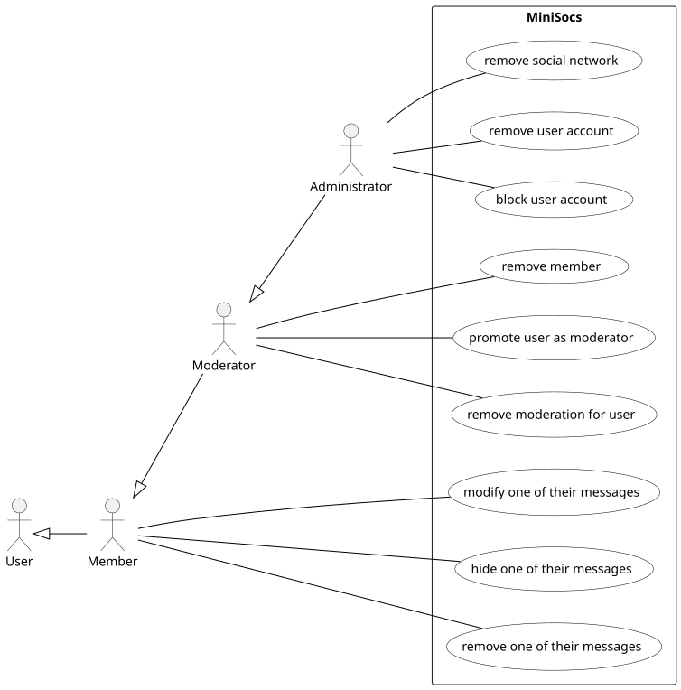
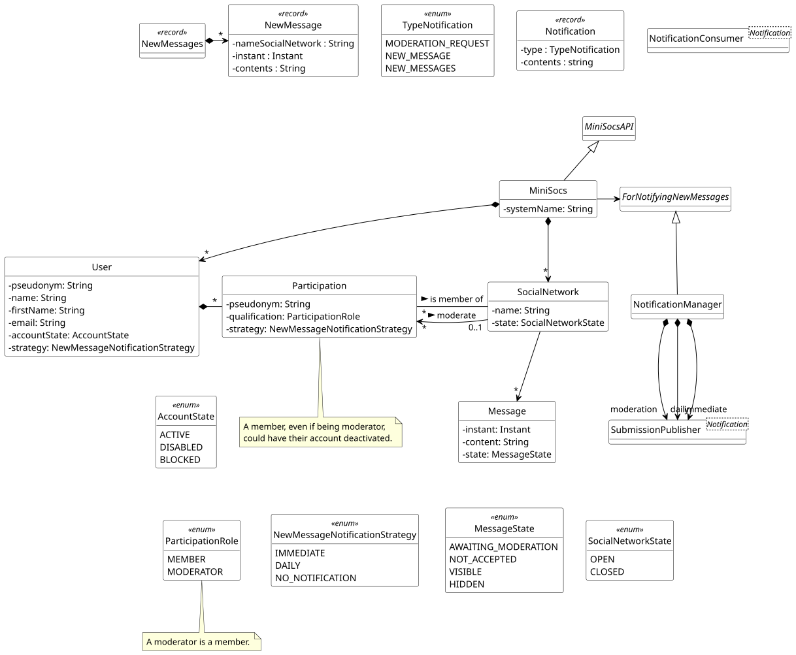
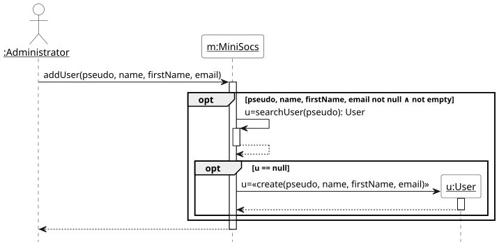
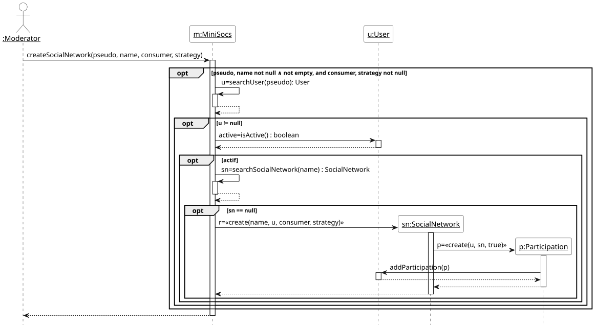
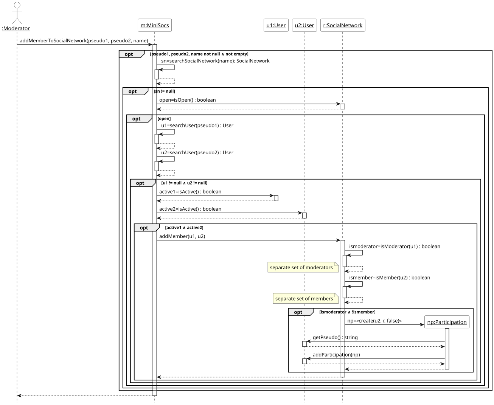
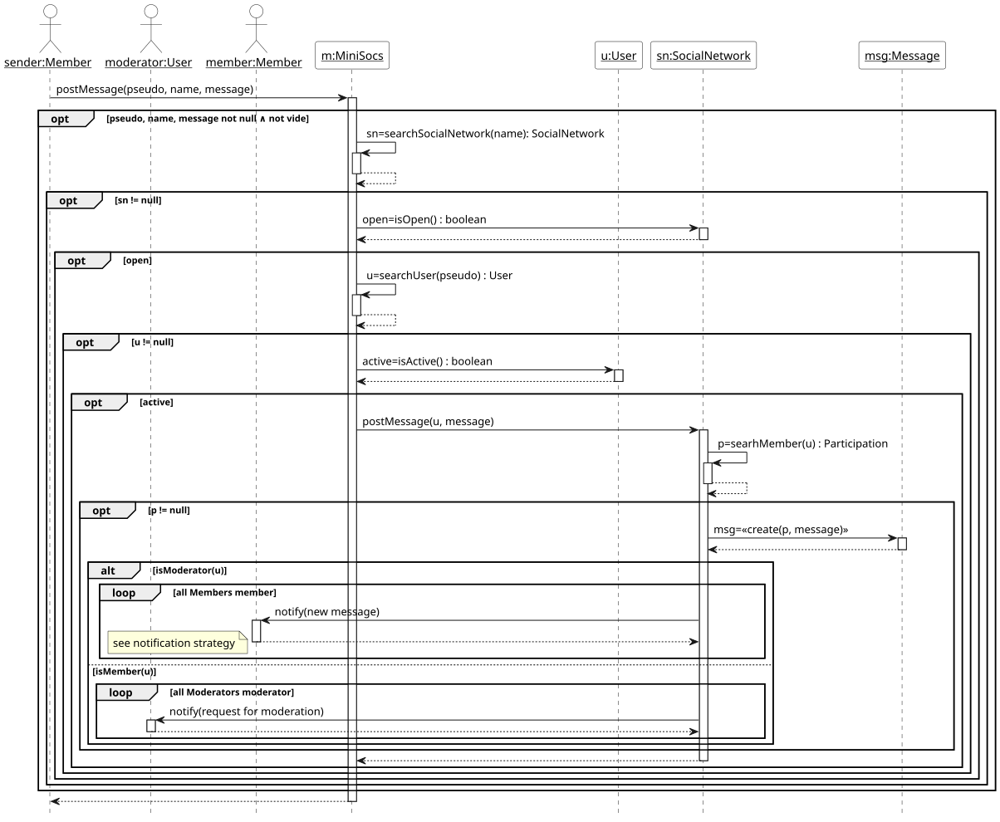
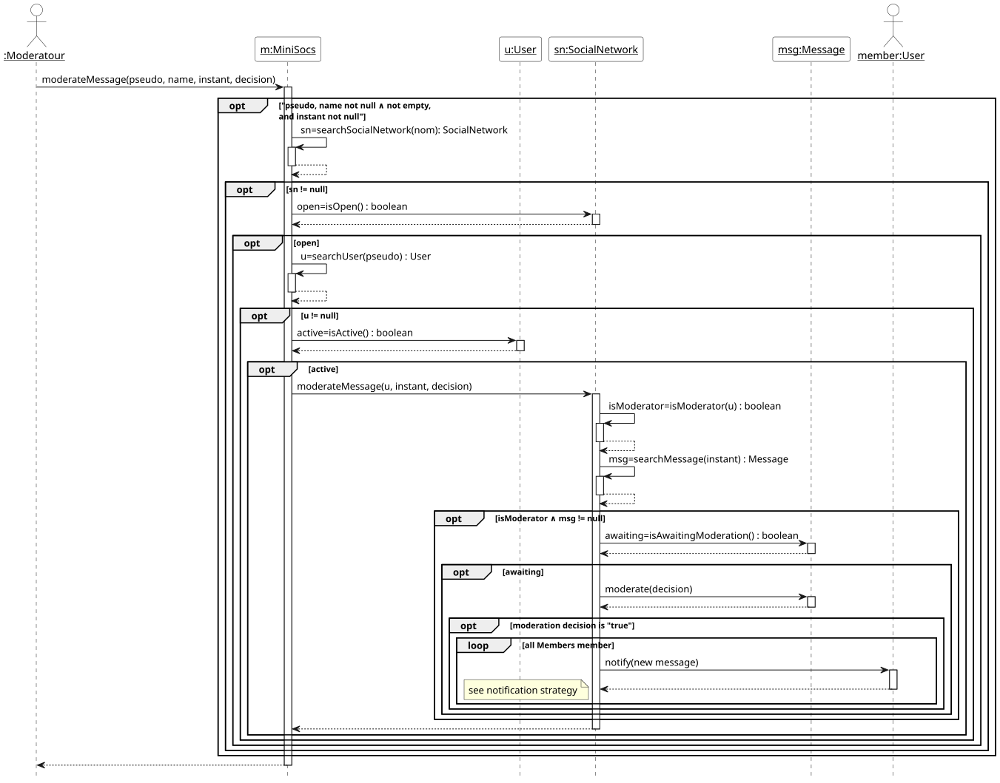
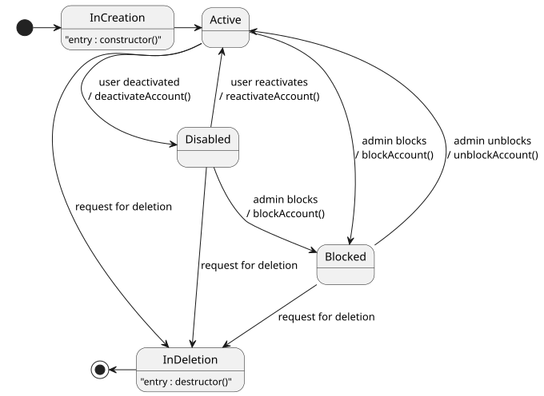
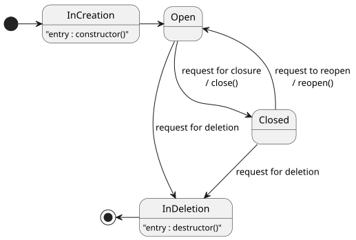

# Management of mini social networks: MiniSocs

## 1. Presentation of the application

You are developing the MiniSocs software for managing mini social
networks. The system administrator’s role involves, amongst other
things, adding, listing, and removing users. To simplify our version
of the software, any user can create a social network and is
automatically granted the right to moderate that new social
network. The moderation function consists mainly, firstly, of adding a
member to the social network; secondly, of promoting a member of the
social network to the role of moderator; and thirdly, of approving
posts before they become visible to members of the social network.

As the name of the application suggests, these are ‘mini social
networks’ in that users of the system can potentially participate in
many social networks and can fine-tune their participation
settings. For example, in addition to a first name, name, and email
address, a user has a pseudonym for the system, and then a potentially
different pseudonym for each of their participations (on different
social networks). Furthermore, to facilitate the governance of these
mini social networks, each one is moderated by several of its
members. The most time-consuming task –and also the one that most
distinguishes them from so-called traditional social networks– is the
‘a priori’ moderation of all posted messages.

The ‘a priori’ moderation process for messages is as follows: (1) a
message is posted on the social network by a member, then (2.a) if the
user posting the message is also a moderator, the message is
immediately visible on the social network, and (2.b) if the poster
is a member who does not moderate the social network, the message must
be approved by one of the moderators before it becomes visible on the
social network. In other words, a message from a moderator does not
need to be moderated, whereas a message from an ‘ordinary’ member is
placed on hold pending moderation. The person moderating the message
may choose not to accept it, in which case the message changes status
from ‘pending moderation’ to ‘not accepted’. To simplify our
design, only one moderation action is provided for: either to
accept the message, thereby making it visible, or to reject
it. Furthermore, the author of a message may decide to hide their
message (which was previously visible).

Any user of the system can deactivate their account. The immediate
consequence is that most of the system’s features are no longer
accessible: for example, they can no longer post messages on a social
network, hide their messages or moderate their social networks. Of
course, it is possible to reactivate an account. Furthermore, a user
account may be blocked by the system administrators. Blocking a user
account has the same effects as deactivation, with the additional
restriction that the user is unable to unblock their account.

A social network may be closed by a moderator. In this case,
most actions on the social network are no longer possible, such as
posting a message, adding a member, or promoting a member to the role
of moderator.

Finally, we introduce notifications for moderation requests to
moderators, as well as notifications for new messages to members of
the social network. Furthermore, the notification strategy for new
posts (for every new post, one message per day, etc.) is chosen on a
per-user basis and per social network.

### 1.1 Example scenario for using the software

Here is a suggested scenario to help you understand the
application. This is by no means a validation test. In this scenario,
the symbol ‘&#x2714;’ indicates that the operation is accepted and
carried out, whilst the symbol ‘&#x2718;’ indicates that the operation
is rejected (not carried out).

- Users and social networks:
  - &#x2714; add user with pseudonym Octave, with new message
    notification strategy ‘immediate’
  - &#x2714; add user with pseudonym Armandine, with new message
    notification strategy ‘daily’
  - &#x2714; add user with pseudonym Raoul, with new message
    notification strategy ‘immediate’
  - &#x2714; add user with pseudonym Gérardine, with new message
    notification strategy ‘immediate’
  - &#x2714; add user with pseudonym Edgar, with new message
    notification strategy ‘no notification’
  - &#x2714; list the users: {Octave, Armandine, Raoul, Gérardine,
    Edgar}
  - &#x2714; Octave creates social network MiddlewareCourse: Octave
    moderates the new social network
  - &#x2714; list social networks: {MiddlewareCourse}

- Members of the social network
  - &#x2714; moderator Octave adds user Armandine to social network
    MiddlewareCourse
  - &#x2718; member Armandine adds user Raoul to social network
    MiddlewareCourse: user Armandine is not a moderator
  - &#x2714; moderator Octave adds user Raoul to social network
    MiddlewareCourse
  - &#x2714; moderator Octave adds user Edgar to social network
    MiddlewareCourse
  - &#x2714; list moderators of social network MiddlewareCourse:
    {Octave}
  - &#x2714; list members of social network MiddlewareCourse: {Octave,
    Armandine, Raoul, Edgar}

- Message posts and new message notifications
  - &#x2714; moderator Octave posts message ‘messageModerator’ on
    social network MiddlewareCourse:
    - the message is accepted and visible without any moderation
    - Octave and Armandine are immediately notified
  - &#x2714; member Armandine posts message ‘messageMember’ on social
    network MiddlewareCourse:
    - moderator Octave is notified of the moderation request
  - &#x2714; moderator Octave moderates the message and marks it as
    accepted
    - message ‘messageMember’ is visible
    - members Octave and Armandine are immediately notified
  - &#x2714; member Armandine posts message ‘messageMember2’ on social
    network MiddlewareCourse:
    - moderator Octave is notified of the moderation request
  - &#x2714; moderator Octave moderates the message and marks it as
    ‘not accepted’
    - message ‘messageMember2’ is not visible
    - there is no notification
  - &#x2718; user Gérardine posts message ‘messageNotMember’ on social
    network MiddlewareCourse: because Gérardine is not a member, she
    is not allowed to post
  - &#x2714; members Octave and Armandine read their unread messages:
      no more messages because visible messages have already been
      notified
  - &#x2714; members Raoul and Edgar read their unread messages:
    {‘messageModerator’, ‘messageMember’}
  - &#x2714; moderator Octave posts message ‘otherMessageModerator’ on
    social network MiddlewareCourse
    - the message is accepted without moderation and is visible
    - members Octave and Armandine are notified
  - &#x2714; as the day draws to a close
    - member Raoul is notified of message ‘otherMessageModerator’

## 2. Specification

### 2.1. Actors et use cases

The first step is to gain a thorough understanding of the system under
study. In the context of this course, this involves reading the
following elements. This reading should enable us to understand the
scope of the system to be developed. The general approach involves
identifying the stakeholders who interact with the system. Next, we
identify the system’s functionalities by defining its use cases. For
this course, the aim is to identify the main functionalities—i.e., we
are not aiming to produce a complete application: this is not
realistic within the time allowed.

Below is the use case diagram showing the most important use cases,
followed by a second use case diagram showing use cases that are more
difficult to develop within the time allocated for the course.

FIXME: what about the notifications?

As a reminder, the documentation for the language used to create UML
diagrams with PlantUML is available at the following address:
https://plantuml.com/fr/

Use Case Diagram 1 ([source code](./Diagrams/minisocs_uml_diag_use_cases.pu))

Use Case Diagramm 2 ([source code](./Diagrams/minisocs_uml_diag_use_cases_others.pu))

### 2.2. Preconditions and postconditions of the use cases

#### Add a user
- precondition : \
∧ pseudonym well-formed (not null ∧ not empty) \
∧ name well-formed  (not null ∧ not empty) \
∧ firstname well-formed  (not null ∧ not empty) \
∧ email well-formed (conforming to RFC822) \
∧ user with this pseudonym does not exist
- postcondition : \
∧ user with this pseudonym exists \
∧ user account is active

#### Deactivate an account
- precondition : \
∧ pseudonym well-formed (not null ∧ not empty) \
∧ user with this pseudonym exists \
∧ user account not blocked \
- postcondition : user account is disabled

N.B. : the operation is idempotent.

#### Create a social network
- precondition : \
∧ pseudonym of the user well-formed (not null ∧ not empty) \
∧ name of the social network well-formed (not null ∧ not empty) \
∧ user with this pseudonym exists \
∧ user account is active \
∧ social network with this name does not exist
- postcondition : \
∧ social network with this name exists \
∧ social network is open \
∧ user is a member of this social network with this pseudonym \
∧ user is a moderator of this social network

N.B. : the pseudonym that is provided is the pseudonym of the user in
the system. At creation time, the pseudonym in the social network is
the same as the pseudonym in the system. A use case is necessary for
changing the pseudonym of the user in this social network.

#### Close a social network
- precondition : \
∧ pseudonym of the moderator well-formed (not null ∧ not empty) \
∧ name of the social network well-formed (not null ∧ not empty) \
∧ user exists with this pseudonym \
∧ user account is active \
∧ social network with this name exists \
∧ social network is open \
∧ user is a moderator of this social network
- postcondition : social network closed

N.B. : the operation is idempotent.

#### Add a member to a social network
- precondition : \
∧ pseudonym of the moderator well-formed (not null ∧ not empty) \
∧ pseudonym of the new member well-formed (not null ∧ not empty) \
∧ name of the social network well-formed (not null ∧ not empty) \
∧ first user (moderator) with this pseudonym exists \
∧ account of the first user is active \
∧ second user (new member) with this pseudonym exists \
∧ account of the second user is active \
∧ social network with this name exists \
∧ social network is open \
∧ first user is a moderator of this social network \
∧ second user is not already a member of this social network
- postcondition : second user is a member of this social network

N.B. : the pseudonym of the moderator that is provided is the
pseudonym of the user in the system, not the pseudonym in the social
network.

N.B. : in this version of the system, the pseudonym of the new member
in the social network is the pseudonym of the user. To allow a
pseudonym that is different from the user’s pseudonym on this social
network, a use case would need to be added:
`changePseudoInSocialNetwork`, which requires two pseudonyms as input
(the pseudonym of the user in the system and the pseudonym of the user
in this social network.

#### Post a message
- precondition : \
∧ pseudonym of the user well-formed (not null ∧ not empty) \
∧ name of the social network well-formed (not null ∧ not empty) \
∧ message well-formed (not null ∧ not empty) \
∧ the moment the message was created not null \
∧ social network with name exists \
∧ social network is open \
∧ user with this pseudonym exists \
∧ account of the user is active \
∧ user is a member of the social  network
- postcondition : \
∧ message added in the social network \
∧ message is a message posted by the member \
∧ identifier returned to the user is well-formed (not null ∧ not empty) \
∧ user == moderator => state of the message = visible \
∧ user == member but not a moderator) => state of the message = awaiting moderation ∧ notification of a moderation request to all moderators \
∧ for all members of the social network, message is visible ∧ (notification strategy = immediate) => (notification of the member ∧ this is the last message notified for the member \
∧ for all members, message is visible ∧ (notification strategy = daily) => (storage for a later notification to the member)

N.B. 1 : When the message comes from a moderator –and is therefore not
moderated– the new message is notified to members of the social
network.

N.B. 2 : For convenience, a ‘declare end of day’ use case can be added
to simulate the strategy of sending all the day’s messages in a single
notification, i.e. a summary message. To keep things simple, all the
day’s messages are included in the notification, not just those that
have not yet been read.

#### Moderate a message
- precondition : \
∧ pseudonym of the user well-formed (not null ∧ not empty) \
∧ user with this pseudonym exists \
∧ account of the user is active \
∧ name of the social network well-formed (not null ∧ not empty) \
∧ id (instant) of the message not null \
∧ social network with this name exists \
∧ social network open \
∧ user is a moderator of this social network \
∧ the message is a message that belongs to this social network \
∧ message state = awaiting moderation
- postcondition : \
∧ decision = yes => message state = visible \
∧ decision = no  => message state = not accepted \
∧ decision = yes => (for all members, notification strategy = immediate => notification ∧ this is the last message notified for the member) \
∧ decision = yes => (for all members, notification strategy = daily => storage for a later notification to the member)

## 3. Preparation of the validation tests of the use cases

#### Add a user

|                                                     | 1 | 2 | 3 | 4 | 5 | 6 |
|:----------------------------------------------------|:--|:--|:--|---|---|---|
| pseudonym well-formed (not null ∧ not empty) ieueue | F | T | T | T | T | T |
| name well-formed  (not null ∧ not empty)            |   | F | T | T | T | T |
| firstname well-formed  (not null ∧ not empty)       |   |   | F | T | T | T |
| email well-formed (respectant le standard RFC822)   |   |   |   | F | T | T |
| user with this pseudonym does not exist             |   |   |   |   | F | T |
|                                                     |   |   |   |   |   |   |
| user with this pseudonym exists                     | F | F | F | F | F | T |
| user account is active                              | F | F | F | F | F | T |
|                                                     |   |   |   |   |   |   |
| number of tests                                     | 2 | 2 | 2 | 3 | 1 | 1 |

Test 4 includes three tests : not null, not empty, and email
well-formed. We could have combined them into a single condition,
given that the RFC822 validation library checks the first two
conditions.

#### Deactivate an account

|                                              | 1 | 2 | 3 | 4 |
|:---------------------------------------------|:--|:--|:--|:--|
| pseudonym well-formed (not null ∧ not empty) | F | T | T | T |
| user with this pseudonym exists              |   | F | T | T |
| user account not blocked                     |   |   | F | T |
|                                              |   |   |   |   |
| user account is disabled                     | F | F | F | T |
|                                              |   |   |   |   |
| number of tests                              | 2 | 1 | 1 | 1 |

#### Create a social network

|                                                             | 1 | 2 | 3 | 4 | 5 | 6 |
|:------------------------------------------------------------|:--|:--|:--|:--|:--|---|
| pseudonym of the user well-formed (not null ∧ not empty)    | F | T | T | T | T | T |
| name of social network well-formed (not null ∧ not empty)   |   | F | T | T | T | T |
| user with this pseudonym exists                             |   |   | F | T | T | T |
| user account is active                                      |   |   |   | F | T | T |
| social network with this name does not exist                |   |   |   |   | F | T |
|                                                             |   |   |   |   |   |   |
| social network with this name exists                        | F | F | F | F | F | T |
| social network is open                                      | F | F | F | F | F | T |
| user is a member of this social network with this pseudonym | F | F | F | F | F | T |
| user is a moderator of this social network                  | F | F | F | F | F | T |
|                                                             |   |   |   |   |   |   |
| number of tests                                             | 2 | 2 | 2 | 1 | 1 | 1 |

#### Close a social network

|                                                               | 1 | 2 | 3 | 4 | 5 | 7 | 8 | 8 |
|:--------------------------------------------------------------|:--|:--|:--|:--|:--|:--|---|:--|
| pseudonym of the moderator well-formed (not null ∧ not empty) | F | T | T | T | T | T | T | T |
| name of the social network well-formed (not null ∧ not empty) |   | F | T | T | T | T | T | T |
| user exists with this pseudonym                               |   |   | F | T | T | T | T | T |
| user account is active                                        |   |   |   | F | T | T | T | T |
| social network with this name exists                          |   |   |   |   | F | T | T | T |
| social network is open                                        |   |   |   |   |   | F | T | T |
| user is a moderator of this social network                    |   |   |   |   |   |   | F | T |
|                                                               |   |   |   |   |   |   |   |   |
| social network closed                                         | F | F | F | F | F | F | F | T |
|                                                               |   |   |   |   |   |   |   |   |
| number of tests                                               | 2 | 2 | 1 | 1 | 1 | 1 | 1 | 1 |

#### Add a member to a social network

|                                                                | 1 | 2 | 3 | 4 | 5 | 6 | 7 | 8 | 9 | 10 | 11 | 12 |
|:---------------------------------------------------------------|:--|:--|:--|:--|:--|:--|:--|:--|:--|:---|----|:---|
| pseudonym of themoderator well-formed (not null ∧ not empty)   | F | T | T | T | T | T | T | T | T | T  | T  | T  |
| name of the social network well-formed (not null ∧ not empty)  |   | F | T | T | T | T | T | T | T | T  | T  | T  |
| pseudonym of the new member well-formed (not null ∧ not empty) |   |   | F | T | T | T | T | T | T | T  | T  | T  |
| first user (moderator) with this pseudonym exists              |   |   |   | F | T | T | T | T | T | T  | T  | T  |
| account of the first user is active                            |   |   |   |   | F | T | T | T | T | T  | T  | T  |
| second user (new member) with this pseudonym exists            |   |   |   |   |   | F | T | T | T | T  | T  | T  |
| account of the second user is active                           |   |   |   |   |   |   | F | T | T | T  | T  | T  |
| social network with this name exists                           |   |   |   |   |   |   |   | F | T | T  | T  | T  |
| social network is open                                         |   |   |   |   |   |   |   |   | F | T  | T  | T  |
| first user is a moderator of this social network               |   |   |   |   |   |   |   |   |   | F  | T  | T  |
| second user is not already a member of this social network     |   |   |   |   |   |   |   |   |   |    | F  | T  |
|                                                                |   |   |   |   |   |   |   |   |   |    |    |    |
| second user is a member of this social network                 | F | F | F | F | F | F | F | F | F | F  | F  | T  |
|                                                                |   |   |   |   |   |   |   |   |   |    |    |    |
| number of tests                                                | 2 | 2 | 2 | 1 | 1 | 1 | 1 | 1 | 1 | 1  | 1  | 1  |

#### Post a message

|                                                                       | 1 | 2 | 3 | 4 | 5 | 6 | 7 | 8 | 9 | 10 |
|:----------------------------------------------------------------------|:--|:--|:--|:--|:--|:--|:--|:--|---|:---|
| pseudonym of the user well-formed (not null ∧ not empty)              | F | T | T | T | T | T | T | T | T | T  |
| name of the social network well-formed (not null ∧ not empty)         |   | F | T | T | T | T | T | T | T | T  |
| message well-formed (not null ∧ not empty)                            |   |   | F | T | T | T | T | T | T | T  |
| the moment the message was created not null                           |   |   |   | F | T | T | T | T | T | T  |
| social network with name exists                                       |   |   |   |   | F | T | T | T | T | T  |
| social network is open                                                |   |   |   |   |   | F | T | T | T | T  |
| user with this pseudonym exists                                       |   |   |   |   |   |   | F | T | T | T  |
| account of the user is active                                         |   |   |   |   |   |   |   | F | T | T  |
| user is a member of the social  network                               |   |   |   |   |   |   |   |   | F | T  |
|                                                                       |   |   |   |   |   |   |   |   |   |    |
| message added in the social network                                   | F | F | F | F | F | F | F | F | F | T  |
| message is a message posted by the member                             | F | F | F | F | F | F | F | F | F | T  |
| identifier returned to the user is well-formed (not null ∧ not empty) | F | F | F | F | F | F | F | F | F | T  |
| user == moderator => state of the message = visible                   |   |   |   |   |   |   |   |   |   |    |
| => state of the message = awaiting moderation                         |   |   |   |   |   |   |   |   |   |    |
| ∧ notification of a moderation request to all moderators              | F | F | F | F | F | F | F | F | F | T  |
| for all members of the social network,                                |   |   |   |   |   |   |   |   |   |    |
| message is visible ∧ (notification strategy = immediate)              |   |   |   |   |   |   |   |   |   |    |
| => (notification of the member                                        |   |   |   |   |   |   |   |   |   |    |
| ∧ this is the last message notified for the member                    | F | F | F | F | F | F | F | F | F | T  |
|                                                                       |   |   |   |   |   |   |   |   |   |    |
| for all members, message is visible ∧ (notification strategy = daily) |   |   |   |   |   |   |   |   |   |    |
| => (storage for a later notification to the member)                   | F | F | F | F | F | F | F | F | F | T  |
|                                                                       |   |   |   |   |   |   |   |   |   |    |
| number of tests                                                       | 2 | 2 | 2 | 1 | 1 | 1 | 1 | 1 | 1 | 2  |

Test 10 comprises two tests, depending on whether the user posting is
a moderator of the social network or not. If the user is a moderator,
the message does not need to be moderated and members are notified of
the new message. If the user is not a moderator, the moderators are
notified of a new moderation request.

#### Moderate a message

|                                                                     | 1 | 2 | 3 | 4 | 5 | 6 | 7 | 8 | 9 | 10 | 11 |
|:--------------------------------------------------------------------|:--|:--|:--|:--|:--|:--|:--|:--|:--|----|:---|
| pseudonym of the user well-formed (not null ∧ not empty)            | F | T | T | T | T | T | T | T | T | T  | T  |
| user with this pseudonym exists                                     |   | F | T | T | T | T | T | T | T | T  | T  |
| account of the user is active                                       |   |   | F | T | T | T | T | T | T | T  | T  |
| name of the social network well-formed (not null ∧ not empty)       |   |   |   | F | T | T | T | T | T | T  | T  |
| id (instant) of the message not null                                |   |   |   |   | F | T | T | T | T | T  | T  |
| social network with this name exists                                |   |   |   |   |   | F | T | T | T | T  | T  |
| social network is open                                              |   |   |   |   |   |   | F | T | T | T  | T  |
| user is a moderator of this social network                          |   |   |   |   |   |   |   | F | T | T  | T  |
| the message is a message that belongs to this social network        |   |   |   |   |   |   |   |   | F | T  | T  |
| message state = awaiting moderation                                 |   |   |   |   |   |   |   |   |   | F  | T  |
|                                                                     |   |   |   |   |   |   |   |   |   |    |    |
| decision = yes => message state = visible                           | F | F | F | F | F | F | F | F | F | T  | T  |
| decision = no  => message state = not accepted                      | F | F | F | F | F | F | F | F | F | T  | T  |
| decision = yes                                                      |   |   |   |   |   |   |   |   |   |    |    |
| => (for all members, notification strategy = immediate              |   |   |   |   |   |   |   |   |   |    |    |
| => notification ∧ this is the last message notified for the member) | F | F | F | F | F | F | F | F | F | T  | T  |
| decision = yes                                                      |   |   |   |   |   |   |   |   |   |    |    |
| => (for all members, notification strategy = daily                  |   |   |   |   |   |   |   |   |   |    |    |
| => storage for a later notification to the member)                  | F | F | F | F | F | F | F | F | F | T  | T  |
|                                                                     |   |   |   |   |   |   |   |   |   |    |    |
| number of tests                                                     | 2 | 1 | 1 | 2 | 1 | 1 | 1 | 1 | 1 | 1  | 2  |

Test 10 comprises two tests, one for each post-condition on the decision.

# 4. Design

As a reminder, the documentation for the language used to create UML
diagrams with PlantUML is available at the following address:
(https://plantuml.com/fr/)

## 4.1. Class diagram

The class diagram produced during an analysis based on the problem
statement is shown in the figure below. In the diagram, the operations
are not shown because there would be too many of them.

**Important: even in detailed design diagrams, attributes representing
associations are not shown.**

(source code in [plantuml](./Diagrams/minisocs_uml_diag_classes.pu))

## 4.2. Sequence diagrams

#### Add a user

(source code in [plantuml](./Diagrams/minisocs_uml_diag_seq_add_user.pu))

#### Create a social network

(source code in [plantuml](./Diagrams/minisocs_uml_diag_seq_create_social_network.pu))

#### Add a member to a social network

(source code in [plantuml](./Diagrams/minisocs_uml_diag_seq_add_member_social_network.pu))

#### Post a message

(source code in [plantuml](./Diagrams/minisocs_uml_diag_seq_post_message.pu))

#### Moderate a message

(source code in [plantuml](./Diagrams/minisocs_uml_diag_seq_moderate_message.pu))

# 5. State machine diagrams and invariants

In state machine diagrams, we choose to show the creation and
destruction states. These states are transient, but they nevertheless
deserve special attention.  The creation state, in particular,
requires, when implemented in an object-oriented programming language,
the writing of a ‘constructor’ operation that ensures that all
attributes are initialised correctly as soon as an instance is
created. We also know that in Java, destruction occurs by ‘forgetting’
the object: a garbage collection mechanism automatically destroys
objects when they are no longer referenced. This is not the case in
all languages; for example, in C++, which lacks a garbage collection
mechanism, the destruction of objects can prove to be a real headache.

Actions triggered by calls from other objects appear in the
transitions. We have retained as internal actions only those
corresponding to calls that the object makes on its own or makes
repeatedly.  Constructors and destructors are exceptions (they appear
internally even though they are triggered by another object).

## 5.1. Class User

(source code in [plantuml](./Diagrams/minisocs_uml_diag_state_machine_user.pu))

Invariant:
∧ pseudonym not null ∧ pseudonym not empty \
∧ name not null && name not empty \
∧ firstName not null ∧ firstName not empty \
∧ email conforms to the standard \
∧ accountState not null \
∧ participations not null \
∧ strategy == NO_NOTIFICATION =>  notificationConsumer == null

## 5.2. Classe Social Network

(source code in [plantuml](./Diagrams/minisocs_uml_diag_state_machine_social_network.pu))

Invariant:
∧ name not null && name not empty \
∧ snState not null \
∧ members' collection not null \
∧ moderators' collection not null \
∧ messages' collection not null

---
END OF THE DOCUMENT
